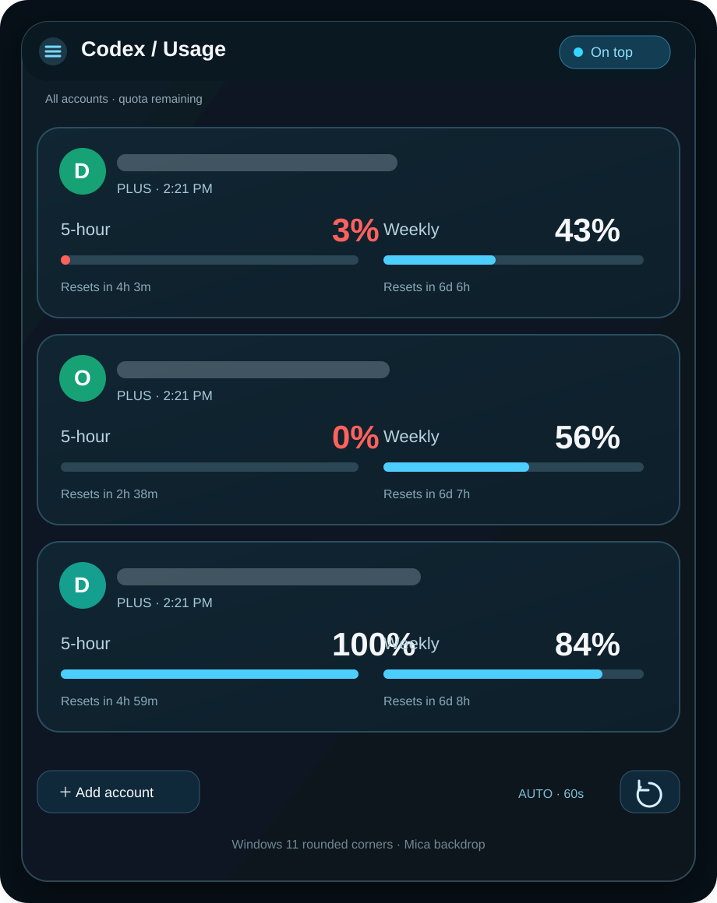
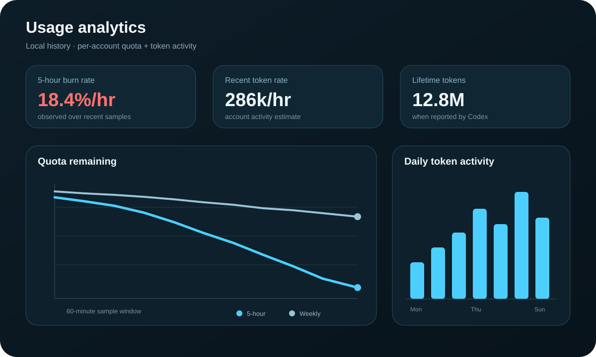

# Codex Usage Widget — Windows Codex Quota & Token Usage Monitor

[](https://github.com/mastachef/codex-usage-widget/releases/latest)
[](https://github.com/mastachef/codex-usage-widget/actions/workflows/build.yml)


**Codex Usage Widget** is a compact Windows Codex usage monitor for tracking ChatGPT Codex subscription quota across multiple accounts. It shows **5-hour limits, weekly limits, reset timers, quota burn rate, and token-usage analytics** in one always-available desktop widget.

> Community project. Not affiliated with or endorsed by OpenAI.

<p align="center">
  
</p>

<p align="center">
  
</p>

## Download Codex Usage Widget for Windows

**[⬇ Download the latest CodexUsageWidget.exe](https://github.com/mastachef/codex-usage-widget/releases/latest/download/CodexUsageWidget.exe)**

No installer or .NET setup is required for the self-contained Windows build.

1. Download `CodexUsageWidget.exe`.
2. Put it in a writable folder you control.
3. Run it.
4. Sign in to each ChatGPT/Codex account you want to monitor.

**Latest releases:** https://github.com/mastachef/codex-usage-widget/releases

## What is Codex Usage Widget?

Codex Usage Widget is a Windows desktop **Codex quota tracker** and **Codex token usage monitor**. It is designed for people using Codex heavily who want to see how quickly their 5-hour and weekly allowance is being consumed without repeatedly opening account pages or switching browser profiles.

It can monitor several ChatGPT/Codex accounts at the same time while keeping each Codex profile isolated.

## Features

- **Multi-account Codex monitoring** with isolated account profiles.
- **5-hour Codex quota remaining** with local reset countdown.
- **Weekly Codex quota remaining** with local reset countdown.
- **Quota burn-rate estimates** based on locally recorded history.
- **Token usage analytics** when the Codex account endpoint reports token activity.
- **Usage history graphs** stored locally on the PC.
- **60-second automatic refresh** with no overlapping refresh cycles.
- **One-click app updates** from GitHub Releases, including SHA-256 verification when GitHub provides a release digest.
- **Always-on-top mode**, system tray support, optional Windows startup, and remembered window size/position.
- **Windows 11 rounded corners and Mica backdrop**, with graceful visual fallback on older Windows.
- Uses separate `CODEX_HOME` directories and Codex's Windows credential store; the widget does not ask for or store account passwords.

## One-click updates

Starting with **v0.2.0**, the widget checks GitHub Releases when it starts.

When a newer version is available, an **Update** button appears in the widget. Click it to:

1. Download the newest `CodexUsageWidget.exe`.
2. Verify the SHA-256 digest when GitHub provides one.
3. Replace the existing EXE.
4. Restart the widget automatically.

You can also right-click the tray icon and choose **Check for updates**.

Your account profiles, settings, and analytics history are stored separately under:

```text
%LOCALAPPDATA%\CodexUsageWidget
```

Updating the EXE does not normally remove that data.

> For one-click replacement, keep the EXE in a folder your Windows account can write to. If it is placed in a protected system folder, Windows may block the replacement.

## Codex usage analytics

The analytics view samples the quota percentages already returned by Codex and stores the history locally. It can show:

- 5-hour quota remaining over time
- Weekly quota remaining over time
- Observed quota burn rate
- Lifetime token activity when available
- Recent token activity rate
- Daily token-usage history
- Peak daily token usage

The quota burn rate is an **observed estimate**, not a fixed tokens-to-quota conversion. Codex subscription limits may use weighting or other factors that are not exposed as a simple public percentage-per-token formula.

## How account sign-in works

Click **Sign in**, complete the official browser sign-in, then use **Add account** for each additional account.

Each account gets its own profile directory under:

```text
%LOCALAPPDATA%\CodexUsageWidget\profiles
```

The profiles are isolated from your normal Codex profile. Credentials remain in Codex's credential store.

**Copy sign-in link** lets you paste the official sign-in URL into a specific browser or browser profile when Windows opens the wrong account automatically.

## What does the widget measure?

The widget displays **Codex subscription rate limits** reported by the Codex app-server.

It does **not** claim to show:

- ordinary ChatGPT model message caps
- OpenAI API billing totals
- a guaranteed token-to-quota conversion

Missing backend values remain unavailable instead of being guessed.

## Windows UI

The widget keeps the normal resizable Windows frame for reliable snapping, resizing, minimize/maximize controls, and accessibility.

On supported Windows 11 builds it requests:

- rounded outer window corners
- immersive dark mode
- Mica system backdrop

Older Windows versions gracefully fall back when those DWM effects are unavailable.

## Build from source

The app requires Codex Desktop to be installed.

```powershell
dotnet publish -c Release -r win-x64 --self-contained true -p:PublishSingleFile=true -o publish
```

Then run:

```text
publish/CodexUsageWidget.exe
```

GitHub Actions also builds the Windows executable automatically.

## Controls

- **Add account** — connect another ChatGPT/Codex account.
- **Refresh** — reload all account limits immediately.
- **Analytics** — open the local usage-history view for an account.
- **On top** — toggle always-on-top mode.
- **Update** — appears when a newer GitHub Release is available.
- **Tray → Check for updates** — manually query the latest release.
- **Tray → Start with Windows** — toggle launch at sign-in.
- **Tray → Quit** — fully exit the widget.

## FAQ

### How can I check my Codex 5-hour and weekly usage on Windows?

Run Codex Usage Widget and connect your ChatGPT/Codex account. The compact account card displays the remaining 5-hour quota, weekly quota, and reset countdowns.

### Can it track multiple ChatGPT Codex accounts?

Yes. Each connected account uses a separate local `CODEX_HOME` profile so the widget can display several accounts together without intentionally merging their credentials.

### Can it graph Codex usage over time?

Yes. The widget records local quota snapshots and provides an analytics view with quota-history and token-activity graphs.

### Can it tell me how many tokens are using my Codex quota?

It can display token activity when Codex reports it, and it can compare that with observed quota changes. It does not assume a fixed token-to-quota conversion because subscription quota may be weighted.

### Does Codex Usage Widget auto-update?

Yes, starting with v0.2.0. It checks GitHub Releases and shows an Update button when a newer version is available.

### Is this an official OpenAI or ChatGPT application?

No. This is an independent community project that uses Codex's available local/app-server interfaces.

### Where is my usage history stored?

Locally under `%LOCALAPPDATA%\CodexUsageWidget\history`.

### Are my ChatGPT passwords stored by the widget?

The widget does not ask for account passwords. Sign-in uses the official browser authentication flow and Codex's credential storage.

## Tests

```powershell
publish/CodexUsageWidget.exe --self-test
```

Tests cover quota math, missing/expired values, account bucket preservation, compact/expanded rendering, isolated logged-out profiles, OAuth start/cancel, and UI behavior.

## Protocol references

- https://learn.chatgpt.com/docs/app-server
- https://learn.chatgpt.com/docs/auth
